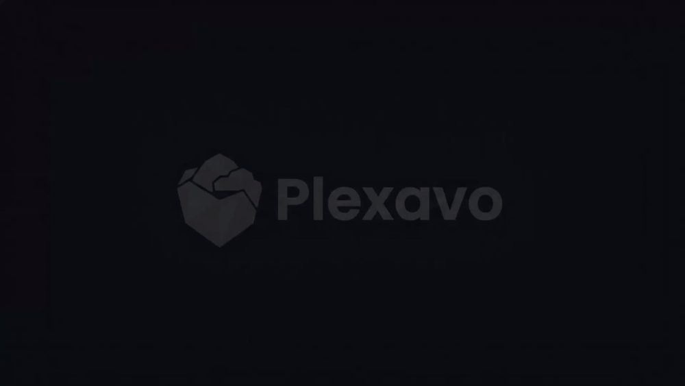
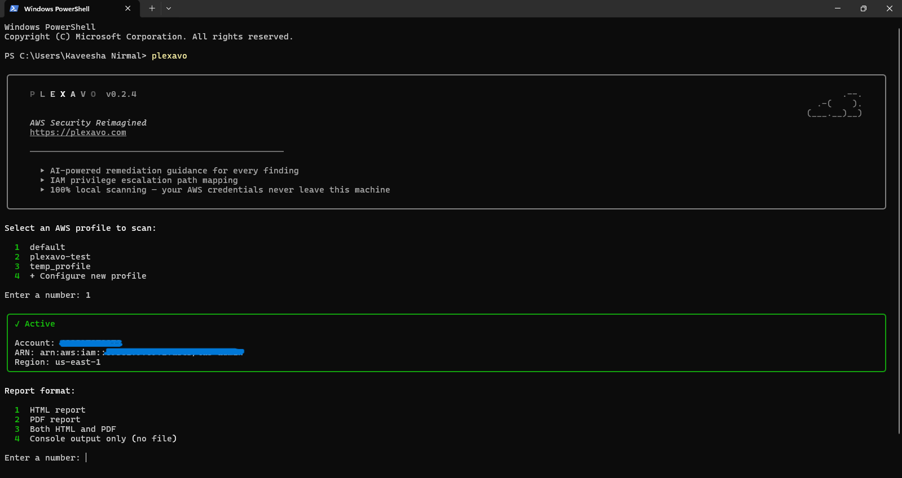
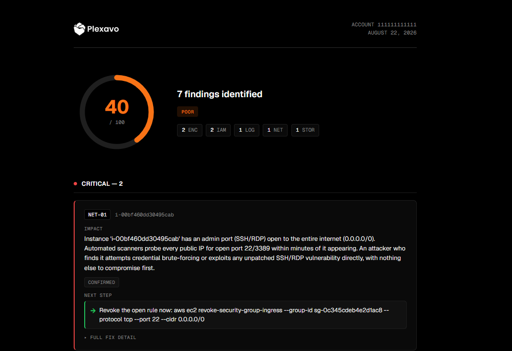

<div align="center">
  <picture>
    <source media="(prefers-color-scheme: dark)" srcset="assets/plexavo-logo-dark.png">
    
  </picture>
</div>

# Plexavo

<div align="center">
  
</div>

Plexavo is an open-source cloud security tool that audits AWS accounts
for real-world misconfigurations. It runs entirely with your own local
AWS credentials, the same way you'd run `aws s3 ls`, so nothing about
your account is ever handed to anyone else. Each scan produces a 0-100
security score and a plain-English report: what's wrong, what an
attacker would actually do with it, and the exact command to fix it.

Detection is pure Python/boto3, never AI. Claude only rewrites
already-found technical findings into something a non-security founder
can read, and it's entirely optional. See [Cost](#cost).

## What it checks

31 checks across 6 categories, run against real AWS accounts:

- **IAM**: privilege escalation paths, wildcard admin, cross-account
  trust, root usage, dormant credentials
- **Network**: security groups and RDS instances exposed to the
  internet
- **Storage**: public S3 buckets, via ACLs, bucket policies, or missing
  Block Public Access
- **Encryption**: unencrypted EBS volumes, RDS instances, S3 buckets
- **Logging**: CloudTrail coverage and encryption, GuardDuty status
- **Usage**: permissions granted but never used, roles nobody has
  assumed in 90+ days

See the `docs/*-TEST-MATRIX.md` files for exactly how each check was
verified.

## Installation

Every path below installs Plexavo into its own isolated environment.

### macOS & Linux

```bash
curl -LsSf https://astral.sh/uv/install.sh | sh   # skip if you have uv
uv tool install plexavo
```

Prefer [pipx](https://pipx.pypa.io/)? `pipx install plexavo` works the
same way.

### Windows

`uv`/`pipx` still work, but the launcher they put on your PATH is
unsigned, and Windows Smart App Control blocks it. Run Plexavo through
Python instead, two options:

**Option 1, uv (recommended)**

```powershell
uv tool install plexavo
Set-ExecutionPolicy -Scope CurrentUser RemoteSigned
if (!(Test-Path $PROFILE)) { New-Item -ItemType File -Path $PROFILE -Force }
Add-Content $PROFILE 'function plexavo { & "$env:APPDATA\uv\tools\plexavo\Scripts\python.exe" -m plexavo @args }'
```

Open a new terminal. `plexavo` now works exactly like it does on
macOS/Linux, routed through uv's signed Python instead of the blocked
launcher.

**Option 2, plain venv**

```powershell
py -m venv plexavo-venv
.\plexavo-venv\Scripts\Activate.ps1
python -m pip install plexavo
python -m plexavo
```

Use `python -m` for everything here too. The venv's own `pip.exe` and
`plexavo.exe` are unsigned as well, only `python.exe` is signed.

### AI narration (optional)

Want each finding rewritten as a full narrative? Install `"plexavo[ai]"`
instead of `plexavo`, and set `ANTHROPIC_API_KEY`. See [Cost](#cost).

## Using Plexavo

Run it with no arguments and it walks you through everything: picking an
AWS profile, choosing HTML or PDF, then scanning and showing your score
with every finding.

```bash
plexavo             # macOS/Linux, and Windows Option 1
python -m plexavo   # Windows Option 2
```

<div align="center">
  
</div>

## The report

Reports are generated as HTML, PDF, or both. Every finding gets a free,
template-based fix by default, no key, no cost. Full AI-written
narration is offered automatically only when an `ANTHROPIC_API_KEY` is
detected, see [Cost](#cost).

<div align="center">
  
</div>

Severity, confidence, and evidence are always shown as separate signals.
A low-confidence Critical never reads the same as a high-confidence
Medium.

## Cost

Detection and the free templates always cost nothing. Live AI only runs
with `--explain`, using **your own** `ANTHROPIC_API_KEY` in **your own**
Anthropic account. Plexavo never sees your key and never calls the API
without it. A full scan with `--explain` typically costs a few cents.

## Contributing

```bash
git clone https://github.com/plexavo/plexavo.git
cd plexavo
uv pip install -e .
```

See [`CONTRIBUTING.md`](CONTRIBUTING.md) for the pattern used to add a
new check.

## Security

Found a vulnerability in the tool itself, not a misconfiguration in your
own AWS account (that's the tool working correctly)? See
[`SECURITY.md`](SECURITY.md) for a private reporting path.

## License

AGPL-3.0, see [`LICENSE`](LICENSE). Use, run, and modify it freely. If
you run a modified version as a hosted service, you're required to
publish those modifications too.
